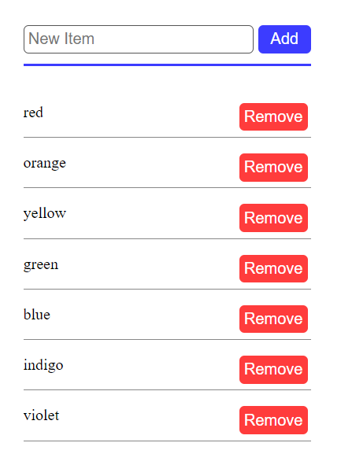

# A simple project of a list items just to exercise Jest knowlange


### This project was create using react
    npx create-react-app test-with-jest --template typescript

### CLI's used to add Jest to the project
    npm i jest -D
    npx jest —init
    npm i ts-node -D
    npm i @types/jest
    npm i @swc/core @swc/jest -D
    npm i @testing-library/react @testing-library/jest-dom @testing-library/user-event -D

**After install swc add this settings in the jest.config.ts file**

```typescript
transform: {
    "^.+\\.(t|j)sx?$": [
      "@swc/jest",
      {
        jsc: {
          parser: {
            syntax: "typescript",
            tsx: true,
            decorators: true,
          },
          keepClassNames: true,
          transform: {
            legacyDecorator: true,
            decoratorMetadata: true,
            react: {
              runtime: 'automatic'
            },
          },
        },
        module:{
          type: 'es6',
          noInterop: false,
        },
      },
    ],
  },
```

**To keep the tests executing**

Add --watchAll to test script on package.json
```json
"scripts": {
    "test": "jest --watchAll",
  },
```
To run the tests

    npm test --watchAll
---

## Project description
Input to type the name of new item

Button to create item with the name in the input

List with each item in a row and a button for remove each item



**Function to add a new item to the list**
```typescript
function addToList(){
    setTimeout(() => {
        setList(state => [...state, newItem]);
        setNewItem('');
    }, 500)
}
```

**Function for removing item to list**
```typescript
function removeFromList(removeItem: string){
    setTimeout(() => {
        setList(state => state.filter(item => item !== removeItem));
    }, 500)
}
```
>The timeout in the functions for simulate an async API call
---

## Tests examples

Default way to test if there is a element with "orange" text content.
```typescript
test('renders learn react link', () => {
  render(<List initialItems={['red', 'orange', 'yellow', 'green', 'blue', 'indigo', 'violet']}/>);
  const linkElement = screen.getByText("orange");
  expect(linkElement).toBeInTheDocument();
});
```

**Add a describe to the component that is testing.**

Test to validate if there are a element with "blue" text content and an element with "green" text content.
```typescript
describe('List Component', () =>{

    it('should render list items', () => {
        const { getByText } = render(<List initialItems={['red', 'orange', 'yellow', 'green', 'blue', 'indigo', 'violet']}/>)

        expect(getByText('blue')).toBeInTheDocument()
        expect(getByText('green')).toBeInTheDocument()
    });
})
```

Using events in test to validate create feature.
```typescript
it('should be able to add new item to the list', async () => {
    const { getByText, getByPlaceholderText, debug } = render(<List initialItems={[]}/>)

    const inputElement = getByPlaceholderText('New Item');
    const addButton = getByText('Add');

    debug() // To show the DOM in the test console in this moment
    
    userEvent.type(inputElement, 'New')
    userEvent.click(addButton);

    debug() // To show the DOM in the test console in this moment

    await waitFor(() => { // wait for a possible api delay
      expect(getByText('New')).toBeInTheDocument()
    })
})
```

Simple test example to validate if a item was removed.
```typescript
it('should be able to remove item to the list', async () => {
    const { queryByText, getAllByText, getByPlaceholderText, debug } = render(<List initialItems={['red', 'orange', 'yellow', 'green', 'blue', 'indigo', 'violet']}/>)

    const removeButtons = getAllByText('Remove');

    debug()
    
    userEvent.click(removeButtons[0]);

    debug()

    await waitForElementToBeRemoved(() => { // Two ways to do the same thing
      return queryByText('red')
    })

    await waitFor(() => { // Two ways to do the same thing
      expect(queryByText('red')).not.toBeInTheDocument()
    })
})
```
